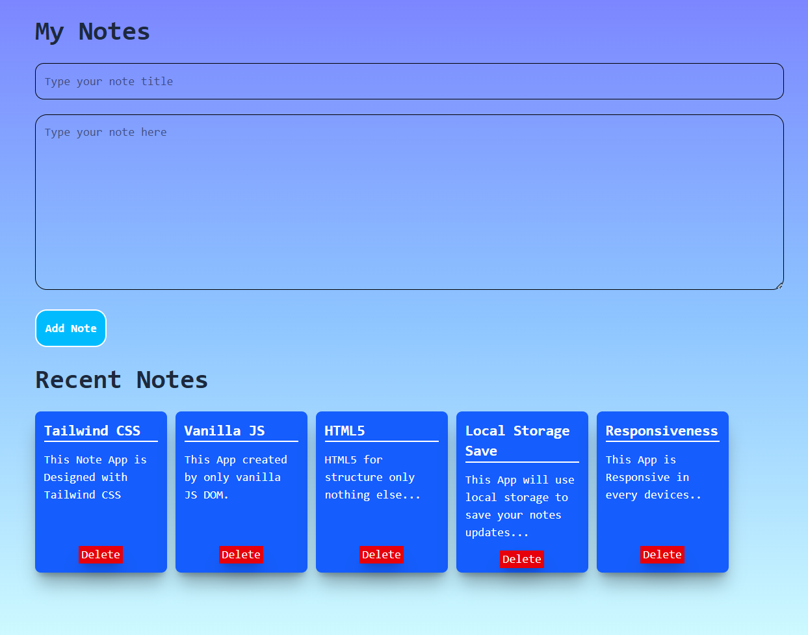

# 📝 Notes App

### A Modern Notes Application Built with HTML, Tailwind CSS & Vanilla JavaScript

Create, save, and manage notes with persistent storage using the browser's Local Storage API.


\

---

## 📸 Preview



---

## ✨ Features

* ✅ Create Notes
* ✅ Delete Notes
* ✅ Persistent Storage with localStorage
* ✅ Dynamic DOM Rendering
* ✅ Responsive Design
* ✅ Tailwind CSS Interface
* ✅ Beginner-Friendly Code Structure

---

## 🚀 Live Demo

🔗 [View Live Demo](https://sayedrisat.github.io/notes-app-javascript-localstorage/)

---

## 🛠️ Built With

| Technology         | Purpose          |
| ------------------ | ---------------- |
| HTML5              | Structure        |
| Tailwind CSS       | Styling          |
| Vanilla JavaScript | Functionality    |
| Local Storage API  | Data Persistence |

---

## 🧠 What I Learned

This project helped me strengthen my understanding of:

* DOM Manipulation
* Dynamic Element Creation
* Event Handling
* Objects & Arrays
* JSON.stringify()
* JSON.parse()
* Local Storage
* Responsive UI Development

---

## ⚙️ How It Works

### 1. Create a Note

The user enters:

* Title
* Description

and submits the form.

### 2. Store Data

JavaScript creates an object:

```js
{
  title: "Learn JavaScript",
  note: "Practice DOM Manipulation"
}
```

The object is pushed into an array and saved to localStorage.

### 3. Render Notes

Cards are generated dynamically using:

```js
document.createElement()
```

### 4. Persist Data

Saved notes are restored automatically after page refresh.

---

## 📂 Project Structure

```bash
notes-app/
│
├── index.html
├── script.js
├── assets/
│   └── screenshot.png
└── README.md
```

---

## 🎯 Future Improvements

* [ ] Edit Notes
* [ ] Search Notes
* [ ] Categories & Tags
* [ ] Dark Mode
* [ ] Pin Notes
* [ ] Export Notes

---

## 🤝 Contributing

Contributions, suggestions, and feedback are welcome.

Fork the repository and submit a pull request.

---

## 👨‍💻 Author

### Sayed Risat

Frontend Developer & Digital Strategist

GitHub: https://github.com/sayedrisat

LinkedIn: https://linkedin.com/in/sayedrisat

---

### ⭐ If you found this project useful, consider giving it a star.

Made with ❤️ while learning JavaScript.
